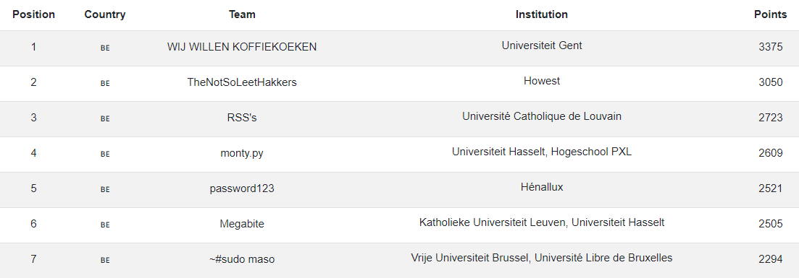

# Finals

### [~$ cd ..](../)

Here are some of the challenges we managed to fully or partially solve during the Finals.

By the end of the four 4 hours rounds we managed to get to the 7th place.

### ~$ ls

* [Alarmed](./alarmed/)
* [Ancient Writings #3](./ancient_writings_3/)
* [Crack Me](./crack_me/)
* [Crack Me 2](./crack_me_2/)
* [cuteFTP](./cute_ftp/)
* [Datacube](./datacube/)
* [Decode Me](./decode_me/)
* [Esher](./esher/)
* [Failing For XOR](./failing_for_xor/)
* [Go EZ](./go_ez/)
* [Hamlet](./hamlet/)
* [John Cage](./john_cage/)
* [Let's Dance](./lets_dance/)
* [None Shall Pass](./none_shall_pass/)
* [NOT Malware](./not_malware/)
* [Password](./password/)
* [Rosetta](./rosetta/)
