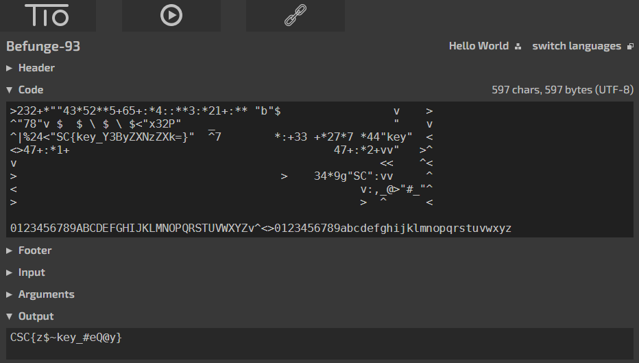

# Ancient Writings #1

### [~$ cd ..](../)

To solve this challenge we were given the following text file with a `.bf` extension:

```
>232+*""43*52**5+65+:*4::**3:*21+:** "b"$                 v    >
^"78"v $  $ \ $ \ $<"x32P"    _                           "    v
^|%24<"SC{key_Y3ByZXNzZXk=}"  ^7        *:+33 +*27*7 *44"key"  <
<>47+:*1+                                        47+:*2+vv"   >^
v                                                       <<    ^<
>                                        >    34*9g"SC":vv     ^
<                                                    v:,_@>"#_"^
>                                                    >  ^      <

0123456789ABCDEFGHIJKLMNOPQRSTUVWXYZv^<>0123456789abcdefghijklmnopqrstuvwxyz
```

We did not know what on earth that thing could be, so our only clue was the file extension.
After a good old Google search we found out that `.bf` was mainly used by `Brainfuck` and `Befunge` programs.
It didn't look like Brainfuck, so we searched for an online `Befunge` interpreter.

Once we found one on one of our favorite websites, we tried to run it.



DONE
