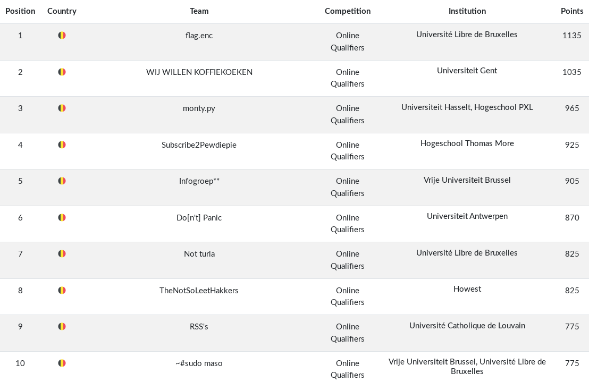

# Qualifiers

### [~$ cd ..](../)

Here are some of the challenges we managed to fully or partially solve during the Qualifiers.

By the end of the 32 contest hours, we managed to get to the 10th place.

### ~$ ls

* [Access Denied](./access_denied/)
* [Alien Object](./alien_object/)
* [Ancient Writings #1](./ancient_writings_1/)
* [Ancient Writings #2](./ancient_writings_2/)
* [Base64 + xor = <3](./base64_xor/)
* [Bot Communication](./bot_communication/)
* [Cert Trouble](./cert_trouble/)
* [Digital Brussels](./digital_brussels/)
* [Dragon.E01](./dragon_e01/)
* [Hacker C4tz](./hacker_c4tz/)
* [Jail Break](./jail_break/)
* [OhMyPad](./oh_my_pad/)
